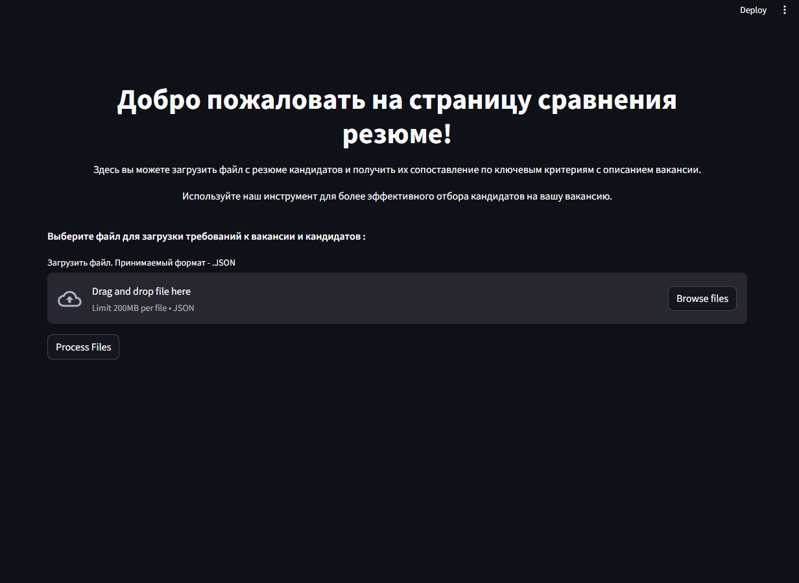

**Описание проекта**

Этот проект представляет собой систему сравнения резюме кандидатов с требованиями вакансии. Он разработан для упрощения процесса отбора кандидатов на вакансию путем автоматического сопоставления навыков и опыта, указанных в резюме, с требованиями, представленными в описании вакансии.

1) Склонируйте репозиторий:
git clone https://github.com/AndreiXaker/ResumeAnaliz.git

2) Откройте папку:
   cd ResumeAnaliz

3) Cоздайте виртуальное окружение: 
   python -m venv venv

4) Активируйте виртуальное окружение:
   .\venv\Scripts\activate
   
5) Установите необходимые библиотеки:
   pip install -r requirements.txt

6) Запустите файл:
   python main.py

7) Выберите файл для загрузки требований к вакансии и кандидатов JSON формата

8) Нажмите Process Files

JSON файл должен быть такого формата: https://github.com/AndreiXaker/ResumeAnaliz/edit/main/docs/test_candidat.json
